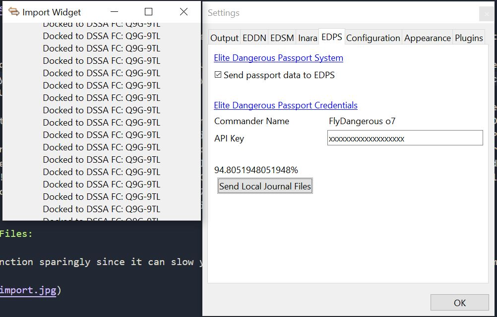

# EDMC Passport System for [EDMC](https://github.com/Marginal/EDMarketConnector/wiki)

EDMC Passport System is a plugin that connects to [EDPS](https://edps.dev) and sends passport data as the commander docks to DSSA FCs.

The system will keep track of DSSA Fleet Carriers that the Commander visits. Each time the commander visits a DSSA Fleet Carrier they will recieve a patch on their Passport. The System requires that the commander signs up on [EDPS](https://edps.dev) in order to recieve an API Key which is required to use this plugin.

## Installation

1. On EDMC's Plugins settings tab press the _Open_ button. This reveals the _plugins_ folder where EDMC looks for plugins.
2. Download the [latest release](https://github.com/RocketMan1988/EDMC-Passport-System/releases).
3. Open the _.zip_ archive that you downloaded and move the _EDMC-Passport-System_ folder contained inside into the _plugins_ folder.

You will need to re-start EDMC to use the newly added plugin.

## Usage and Settings

The first thing the user must do is goto the EDMC's settings menu and enter their API Key provided to them by [EDPS](https://edps.dev) after sign up. Make sure that the checkbox for "Send passport data to EDPS" is checked. Afterwards select the _Ok_ button from setttings and then relaunch the EDMC. 

After the settings are configured as stated above: The user should recieve a messages within the EDPS output row for specific docking events. A full list of messages is below:

1) DSSA Docking Added to Passport: The passport was successfully added to your passport! (Feel free to verify at [EDPS](https://edps.dev))
2) Passport Already Acquired: The passport was already aquired by the commander, so no need to report docking to EDPS.
3) API Key Wrong: Update in File-->Settings - If Lost then Generate New one on [EDPS](https://edps.dev))
4) Error Adding to Passport - Restart EDMC and Try to Redock?: Unknown error - Try to restart EDMC and redock. If problem continues then email us. Email address is located at the bottom of [EDPS](https://edps.dev)).
5) DSSA Docking Detected, but User needs to enable sending data: Goto File-->Settings-->Select the Send Data Chackbox and then restart EDMC. After restarting EDMC then redock.
6) Outdated Plugin Version - Please Download New Version: Please download and install the latest EDMC-EDPS Plug in here: [latest release](https://github.com/RocketMan1988/EDMC-Passport-System/releases)
7) Error: Request returned a non-200 status code in AppInformation: Unknown error most likely tied to our server. Please email us. Email address is located at the bottom of [EDPS](https://edps.dev)).
8) Unknown Error Reaching Server: Unknown error most likely tied to our server. Please email us. Email address is located at the bottom of [EDPS](https://edps.dev)).
9) Cmder not found! Sign up at edps.dev! (Important: Commander Name during sign up is Case Sensitive): Please sign up at [EDPS](https://edps.dev). If you already signed up then most likely you need to resign up using the proper case for each letter of your commander name. (So if your commander's name is 'FlyDangerous o7' then don't sign up using 'flydangerous o7')
10) Cannot connect to Server - Check Internet Connection and Relaunch! (You may need to kill EDMC in the Task Manger): No internet connection was detected

## Import Journal Files:

Please use this function sparingly since it can slow your computer down. (Really there isn't a reason to use this functionlity more than once for the inital import) This function will attempt to import your Local Journal Files and attempt to send them to [EDPS](https://edps.dev). Please don't close out of the new window that opens until the import process has finished.

